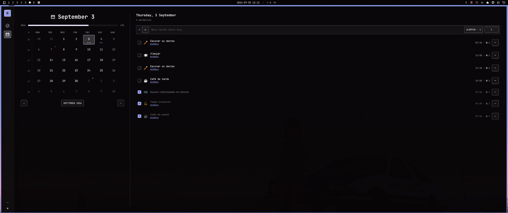
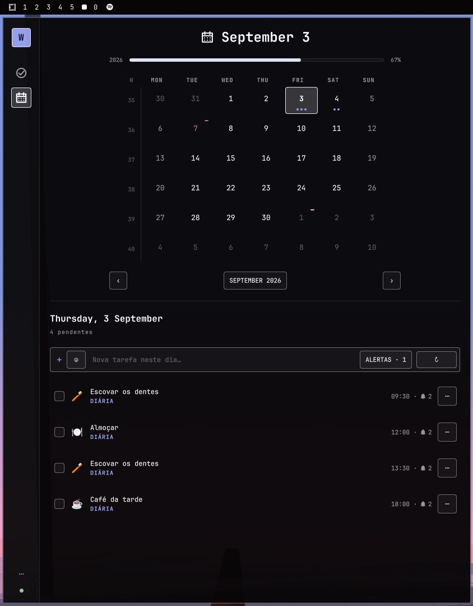
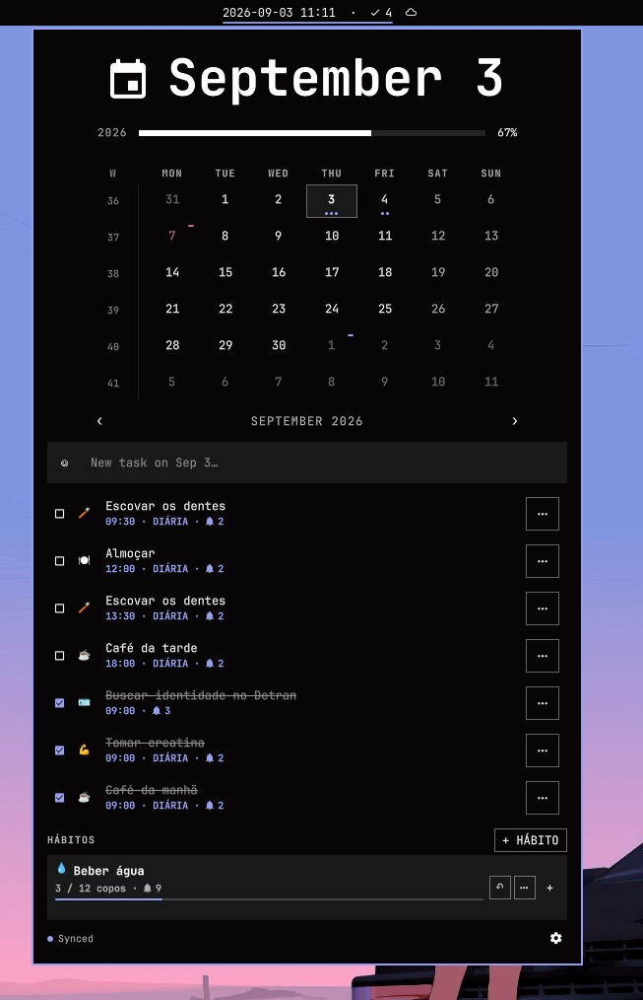
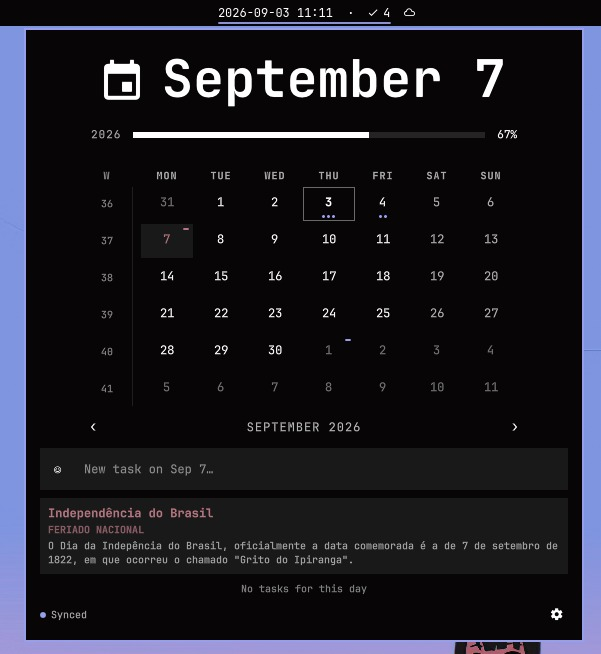
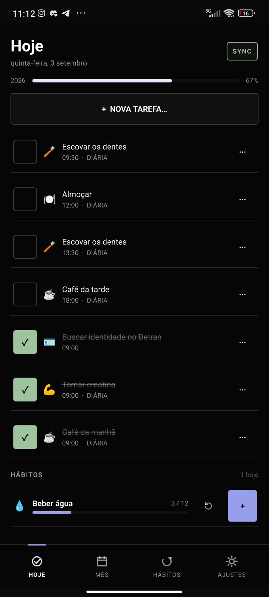
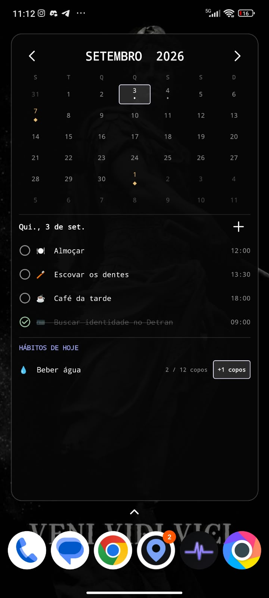

# Waypoint

<p align="center">
  <strong>A local-first calendar, task manager, and habit tracker for Linux and Android.</strong><br>
  Plan with Brazilian holiday context, build routines, and keep every device in sync through your own server.
</p>

<p align="center">
  <a href="https://github.com/EaeDave/waypoint/actions/workflows/ci.yml"></a>
  <a href="https://github.com/EaeDave/waypoint/releases/latest"></a>
  <a href="LICENSE"></a>
</p>

<p align="center">
  
</p>

Waypoint keeps the fast path local: tasks, recurrence state, habit check-ins, holiday data, and pending changes live in SQLite. A self-hosted synchronization API makes the same plan available on Linux and Android without turning an internet connection into a requirement.

<p align="center">
  <a href="#install-waypoint"><strong>Install Waypoint</strong></a> ·
  <a href="#deploy-the-synchronization-server"><strong>Deploy sync</strong></a> ·
  <a href="https://github.com/EaeDave/waypoint/releases/latest"><strong>Latest release</strong></a>
</p>

## Why Waypoint

| Plan with context | Build routines | Stay close to the work |
| --- | --- | --- |
| See dated and recurring tasks directly in a month calendar, alongside the Brazilian holidays that matter where you live. | Track measurable daily goals with flexible check-in modes, selected weekdays, reminders, and visible progress. | Use the full desktop or Android app, an Android home-screen widget, the Omarchy bar, or the Linux CLI—all backed by the same local data. |

### Calendar and tasks

- Month calendar with focused-day details, pending/completed markers, overdue work, and week numbers.
- Date-based tasks with an optional local time, emoji, and up to five advance reminders.
- Recurrence by interval and weekday, with end-by-date and end-after-count rules.
- Complete, reopen, skip, reschedule, or edit one occurrence, this and following occurrences, or an entire series.
- Switch between all tasks and pending-only tasks; the preference synchronizes across desktop, Android, the home-screen widget, and the Omarchy panel.
- Floating calendar dates and local wall-clock times: a task stays on the day and time the user chose instead of shifting through UTC.

### Brazilian holidays

Waypoint can place Brazilian calendar events next to tasks rather than forcing users to consult a separate holiday calendar.

- National holidays.
- State holidays selected by federative unit.
- Municipal holidays selected from IBGE municipality codes.
- Optional dates and commemorative dates, independently configurable.
- Local holiday cache for calendar access when offline; preferences synchronize with the Waypoint server.

### Habit tracking

- A daily target, optional unit, emoji, selected weekdays, and multiple reminder times per habit.
- **Fixed increment** check-ins for repeatable units such as glasses of water or pages read.
- **Manual amount** check-ins when each entry varies.
- **Complete all** check-ins for binary routines.
- Daily progress and undo support, with quick check-ins available from the Android widget and Omarchy panel.

### Local-first synchronization

Every client writes to SQLite first and queues mutations in an offline outbox. The Rust synchronization API stores shared state in PostgreSQL. Android supports background synchronization and optional Firebase Cloud Messaging wakeups; periodic polling remains available when Firebase is not configured.

## One plan, four surfaces

### Linux desktop

The wide overview above combines the month view, selected-day tasks, holiday details, and habit progress. The same workspace responds cleanly to a compact window beside the rest of your work.

<p align="center">
  <br>
  <sub>Compact desktop layout</sub>
</p>

The Linux package also includes `waypointd` for reminders and synchronization, `waypointctl` for terminal workflows, desktop notifications, and a systemd user service.

### Omarchy bar plugin

The optional Omarchy plugin puts the calendar where it is most useful: one click from the bar. Review today's workload and holidays without changing windows, then add or edit tasks, complete or skip occurrences, and check in habits directly from the panel. It reduces context switching while retaining the full calendar model and local-first behavior of the desktop app.

<table>
  <tr>
    <td width="50%" align="center">
      <br>
      <sub>Calendar and task workflow from the Omarchy bar</sub>
    </td>
    <td width="50%" align="center">
      <br>
      <sub>Holiday context without leaving the current workspace</sub>
    </td>
  </tr>
</table>

The Linux installer enables the plugin automatically when it detects Omarchy.

### Android app and home-screen widget

The Android app carries the complete calendar, task, habit, holiday, reminder, and sync experience. The resizable home-screen widget keeps the month, selected-day tasks, and habit progress visible before the app is opened. Navigate months, select dates, switch between all and pending tasks, complete or reopen tasks, and check in habits from the launcher; each action updates local storage immediately and schedules background synchronization.

That short interaction path matters for routines: fewer app-opening steps make quick capture and daily check-ins easier, while the calendar remains visible beside the rest of the home screen.

<table>
  <tr>
    <td width="50%" align="center">
      <br>
      <sub>Full Android application</sub>
    </td>
    <td width="50%" align="center">
      <br>
      <sub>Interactive home-screen widget</sub>
    </td>
  </tr>
</table>

## Install Waypoint

### Linux x86_64

Install the latest release for the current user:

```bash
curl -fsSL https://raw.githubusercontent.com/EaeDave/waypoint/main/install.sh | bash
```

The installer verifies the release checksum, installs the application under `~/.local/lib`, creates commands in `~/.local/bin`, installs the desktop entry, and enables the `waypointd` user service. If Omarchy is installed, it also enables the Waypoint bar plugin.

`waypointd` checks the latest stable GitHub release every six hours. The desktop settings page and Omarchy panel show the installed version and offer an update action when a newer release exists. Updates from this installer are downloaded with their published SHA-256 checksum, staged under `~/.local/lib`, activated atomically, and rolled back if the updated daemon does not become ready. Source builds and system-package installations are never overwritten.

Ensure `~/.local/bin` is in `PATH`, then launch:

```bash
waypoint
```

The release package currently targets glibc-based Linux distributions on x86_64.

### Android

Download `waypoint-android-arm64.apk` from the [latest GitHub release](https://github.com/EaeDave/waypoint/releases/latest). Android may ask for permission to install applications from the browser or file manager used to open the APK.

After the first installation, open **Settings → Application** in Waypoint to check for and install releases. Waypoint downloads the APK, verifies it against the release `SHA256SUMS`, and opens Android's package installer. Android may require the per-app **Install unknown apps** permission and always controls the final installation confirmation.

Requirements:

- Android 9 or newer (API 28+).
- An arm64-v8a device.
- An HTTPS synchronization endpoint; the Android application rejects cleartext HTTP.

The GitHub release is currently the only Android distribution channel.

## Deploy the synchronization server

Waypoint is a single-user service. One shared Bearer token grants full access to tasks, habits, holiday preferences, and registered push devices. Run a separate instance and token for each trust boundary.

### Docker Compose (recommended)

Requirements:

- Docker Engine 24 or newer.
- Docker Compose v2.
- A hostname and TLS reverse proxy for remote clients.

Create the environment file and generate both secrets:

```bash
cp .env.example .env
openssl rand -hex 24
openssl rand -hex 32
```

Use the first value as `POSTGRES_PASSWORD` and in the password portion of `DATABASE_URL`. Use the second value as `WAYPOINT_SYNC_TOKEN`. Then start PostgreSQL and the API:

```bash
docker compose up --build --detach
curl --fail http://127.0.0.1:8787/health
```

The expected response is:

```json
{"status":"ready"}
```

The Compose stack exposes the API only on `127.0.0.1`. Put a TLS reverse proxy such as Caddy, nginx, or Traefik in front of it before connecting a remote client. A minimal Caddy route is:

```caddyfile
waypoint.example.com {
    reverse_proxy 127.0.0.1:8787
}
```

Operational commands:

```bash
docker compose logs --follow api
docker compose pull
docker compose up --build --detach
docker compose down
```

`docker compose down` preserves the named PostgreSQL volume. Add `--volumes` only when intentionally deleting all synchronized server data.

### Container platforms

The root `Dockerfile` builds the synchronization API. Connect it to an external PostgreSQL database, expose container port `8787`, and configure:

| Variable | Required | Purpose |
| --- | --- | --- |
| `DATABASE_URL` | Yes | PostgreSQL connection URL. |
| `WAYPOINT_SYNC_TOKEN` | Yes | Shared 32–512 character Bearer token. |
| `WAYPOINT_BIND` | Yes | Use `0.0.0.0:8787` inside the container. |
| `RUST_LOG` | No | Rust tracing filter; defaults to `info`. |
| `WAYPOINT_FIREBASE_SERVICE_ACCOUNT_JSON` | No | Compact Firebase service-account JSON for push wakeups. |

Terminate TLS at the platform proxy and verify `/health` before configuring a client.

### Run the API directly

Requirements:

- Rust 1.89 or newer.
- PostgreSQL 14 or newer.
- A database and user represented by `DATABASE_URL`.

Load the environment and start the server:

```bash
cp .env.example .env
# Edit DATABASE_URL and WAYPOINT_SYNC_TOKEN first.
set -a
source .env
set +a
cargo run --locked --release --package waypoint-api
```

Database migrations run automatically during startup. The default listener is `127.0.0.1:8787`.

### Firebase push wakeups

Firebase Cloud Messaging is optional. Without it, Android continues to synchronize through periodic polling.

For the server, set `WAYPOINT_FIREBASE_SERVICE_ACCOUNT_JSON` to the compact contents of a Firebase service-account JSON file. This value contains a private key and must be stored only in the deployment platform's secret store. Never commit the JSON file or value.

For Android builds, provide all four non-secret Firebase application values:

- `WAYPOINT_FIREBASE_APPLICATION_ID`
- `WAYPOINT_FIREBASE_API_KEY`
- `WAYPOINT_FIREBASE_PROJECT_ID`
- `WAYPOINT_FIREBASE_SENDER_ID`

## Configure a client

Open **Settings** in the Linux or Android application and enter:

- Server endpoint: `https://waypoint.example.com/v1/sync`
- Bearer token: the value of `WAYPOINT_SYNC_TOKEN`

Use HTTPS whenever the endpoint leaves the local machine. The token authorizes the complete instance and should not be shared, logged, committed, or embedded in support output.

## Build from source

### Linux desktop

Requirements:

- CMake 3.28 or newer.
- Ninja.
- A C++20 compiler.
- Qt 6.8 or newer with Core, DBus, GUI, Network, QML, Quick, Quick Controls 2, SQL, and Test.
- Qt SQLite driver.
- Rust 1.89 or newer.

Configure, build, test, and install for the current user:

```bash
cmake --preset dev
cmake --build --preset dev
ctest --preset dev
cargo test --workspace
cmake --install build/dev --prefix "$HOME/.local"
```

For an optimized build:

```bash
cmake --preset release
cmake --build --preset release
```

`bin/setup` performs a developer installation and wires the Omarchy plugin from the checkout.

### Android APK

Requirements:

- Qt 6.9.3 host and Android kits.
- Android SDK platform 35 and build tools 35.0.0.
- Android NDK 27.2.12479018.
- Java 17.
- CMake and Ninja.

Set tool locations when they differ from the defaults in `bin/build-android`, then build:

```bash
export QT_HOST_ROOT="$HOME/Qt/6.9.3/gcc_64"
export QT_ANDROID_ROOT="$HOME/Qt/6.9.3/android_arm64_v8a"
export ANDROID_SDK_ROOT="$HOME/Android/Sdk"
export ANDROID_NDK_ROOT="$ANDROID_SDK_ROOT/ndk/27.2.12479018"
export JAVA_HOME="/path/to/jdk-17"
ANDROID_ABI=arm64-v8a ANDROID_BUILD_TYPE=Debug bin/build-android
```

The output is `waypoint-android-arm64-debug.apk`. Set the optional Firebase application variables from `.env.example` to enable push wakeups.

Release builds require a stable signing key:

```bash
export QT_ANDROID_SIGN_APK=ON
export QT_ANDROID_KEYSTORE_PATH=/absolute/path/to/waypoint-release.jks
export QT_ANDROID_KEYSTORE_ALIAS=waypoint
export QT_ANDROID_KEYSTORE_STORE_PASS='...'
export QT_ANDROID_KEYSTORE_KEY_PASS='...'
ANDROID_BUILD_TYPE=Release bin/build-android
```

Never publish or lose the signing keystore. Android updates must be signed by the same key.

## Development

Coding agents must read [`AGENTS.md`](AGENTS.md) before changing or deploying Waypoint. It records architecture boundaries, the least-effort delivery path, deployment acceptance checks, release requirements, secrets handling, and the canonical verification commands.

Run the complete local verification suite:

```bash
cmake --build --preset dev
ctest --preset dev
cargo test --workspace
cmake --build build/dev --target waypoint_qmllint
cargo clippy --workspace --all-targets -- -D warnings
cargo audit --ignore RUSTSEC-2023-0071
```

`RUSTSEC-2023-0071` applies to the optional `rsa` crate retained in `Cargo.lock` by `sqlx-postgres`. It is not present in Waypoint's selected dependency graph (`cargo tree -i rsa` is empty). FCM signing uses the `aws-lc-rs` backend.

Android UI smoke tests are defined under `.maestro/`.

### Continuous integration and releases

`.github/workflows/ci.yml` builds and tests Linux, audits Rust dependencies, builds the server container, and builds a generic arm64 debug APK without Firebase configuration for every pull request and push to `main`.

`.github/workflows/release.yml` reads the semantic version from `CMakeLists.txt`. When `main` contains a version without a corresponding `v<version>` tag, it builds the maintainer's signed, Firebase-enabled Android APK and a bundled Linux package, creates the tag, generates checksums, and publishes a GitHub release. `server/Cargo.toml` must contain the same version.

Configure these GitHub Actions repository secrets before the first release:

- `ANDROID_KEYSTORE_BASE64`
- `ANDROID_KEYSTORE_ALIAS`
- `ANDROID_KEYSTORE_PASSWORD`
- `ANDROID_KEY_PASSWORD`

Add the four `WAYPOINT_FIREBASE_*` Android values listed above as GitHub Actions repository variables. They are embedded in the maintainer's released APK and therefore are identifiers, not confidential credentials. Forks should replace them with their own Firebase Android application values. Keep `WAYPOINT_FIREBASE_SERVICE_ACCOUNT_JSON` server-only.

Create and encode a signing key with:

```bash
keytool -genkeypair -v \
  -keystore waypoint-release.jks \
  -alias waypoint \
  -keyalg RSA \
  -keysize 4096 \
  -validity 10000
base64 -w 0 waypoint-release.jks
```

To publish a new release, update both version declarations and push to `main`:

```cmake
project(Waypoint VERSION 0.2.0 LANGUAGES CXX)
```

```toml
[package]
version = "0.2.0"
```

### Repository layout

- `src/` — C++ core, synchronization, desktop, daemon, CLI, and mobile bridge code.
- `qml/` — Linux and Android interfaces.
- `android/` — Android manifest, services, widget, and Gradle additions.
- `server/` — Rust synchronization API and PostgreSQL migrations.
- `plugins/omarchy-waypoint/` — Omarchy bar plugin.
- `packaging/` — desktop entry, icon, and systemd user service.
- `tests/` — C++ behavioral tests.
- `.maestro/` — Android UI smoke tests.

## Security

- `.env`, Android keystores, Firebase service-account files, databases, and generated APKs must remain untracked.
- The API container runs as an unprivileged user and binds to localhost through the Compose stack.
- The API requires a 32–512 character Bearer token and compares it in constant time.
- Android rejects cleartext HTTP synchronization endpoints.
- GitHub Actions use read-only permissions by default; only the release publishing job receives `contents: write`.
- Third-party Linux deployment binaries are pinned to immutable releases and verified by SHA-256.

## License

Waypoint is free software licensed under the [GNU Affero General Public License, version 3 or later](LICENSE). You may use, study, modify, and redistribute it under the terms of that license. Modified versions offered over a network must provide their corresponding source code to their users.

Copyright © 2026 EaeDave.
